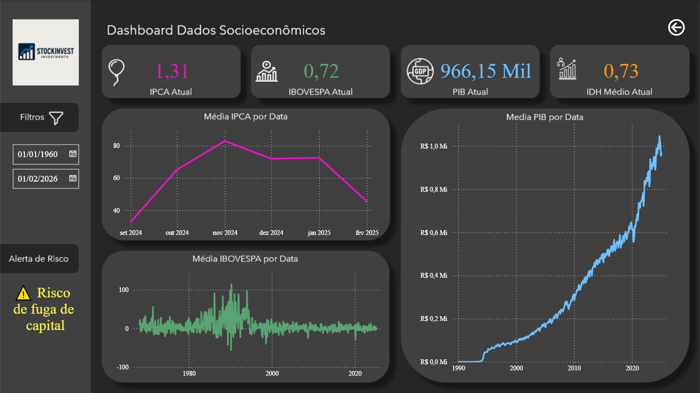
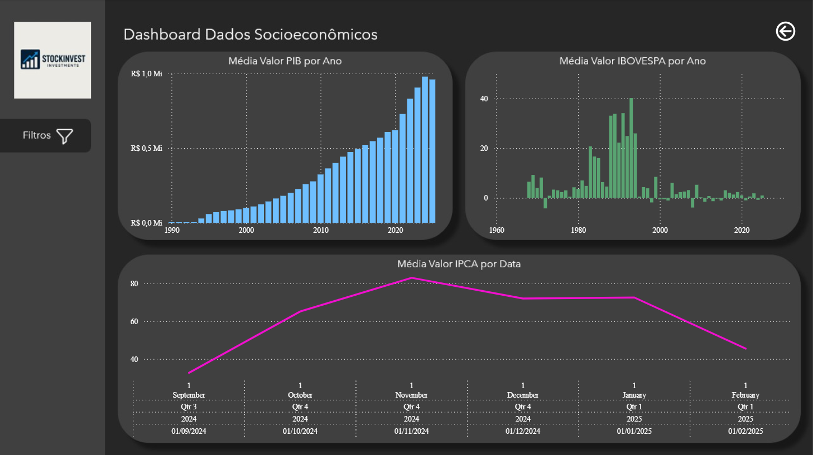
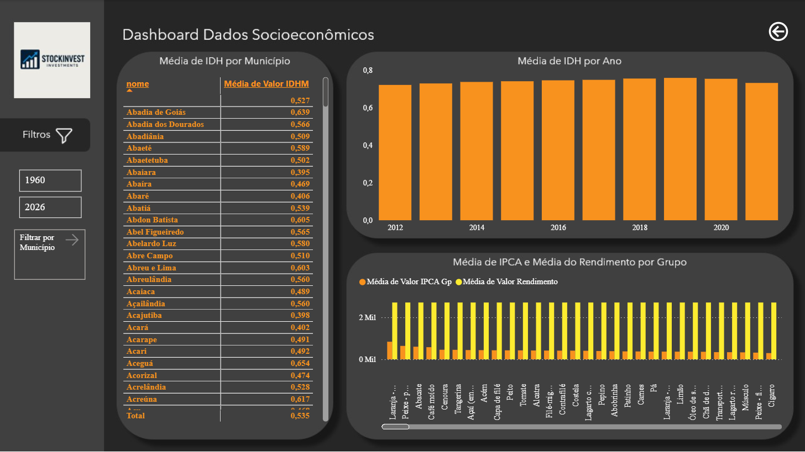
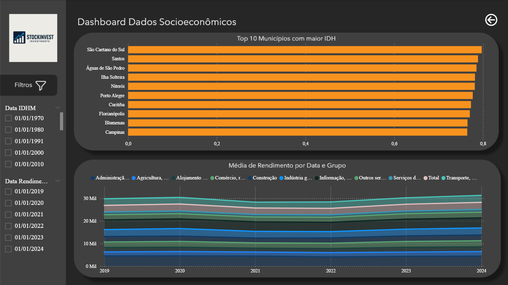

# Dashboard Dados Socioeconômicos

Este repositório contém informações extraídas de um **dashboard socioeconômico** que reúne **indicadores macroeconômicos**, **índices de mercado** e dados de **desenvolvimento humano** por município.

--- 

# 📊 Indicadores Econômicos

- **PIB** (Produto Interno Bruto): Valores **médios** por **ano** e por **data**, com séries históricas desde **1960** até **2026**.
- **IBOVESPA**: **Média** de valores por **ano** e por **data**, representando o desempenho do mercado acionário brasileiro.
- **IPCA** (Índice de Preços ao Consumidor Amplo): **Média** por **data** e por **grupo de produtos**, incluindo alimentos, carnes, bebidas e outros itens de consumo.

---

# 🏙️ Indicadores Sociais

### IDH Municipal: 
Média de valores por município, com destaque para:

- Abadia de Goiás: **0,639**
- Abadia dos Dourados: **0,566**
- Abadiânia: **0,509**
- Abaeté: **0,589**
- Abaetetuba: **0,502**
- Abaiara: **0,395**
- Aceguá: **0,654**
- Acreúna: **0,617**

Média geral: **0,535**

### Top 10 Municípios com maior IDH:

- São Caetano do Sul
- Santos
- Águas de São Pedro
- Ilha Solteira
- Niterói
- Porto Alegre
- Curitiba
- Florianópolis
- Blumenau
- Campinas

---

# 📈 Séries Temporais

**Média de IDH por Ano:** Dados disponíveis entre 2012 e 2020.
**Média de IPCA por Data:** Séries mensais entre setembro de 2024 e fevereiro de 2025.
**Média de Rendimento por Data e Grupo:** Valores médios de rendimento por setores econômicos entre 2019 e 2024.

---

# 📷 Prints do Dashboard
- Os prints das visualizações do Dashboard também se encontram na pasta /images

---

# 🗂️ Estrutura do Dashboard

Filtros disponíveis por:

- Município
- Data (PIB, IBOVESPA, IPCA, IDH, Rendimento)
- Setor econômico (Agricultura, Indústria, Comércio, Serviços, Transporte, etc.)

---

# 🚀 Objetivo

O dashboard tem como finalidade fornecer uma **visão integrada** dos principais **indicadores** socioeconômicos brasileiros, permitindo **análises comparativas** entre municípios, setores e períodos históricos.

---

# 📌 Fonte dos Dados

Os dados utilizados neste dashboard são provenientes do **IPEADATA**, plataforma oficial do Instituto de Pesquisa Econômica Aplicada **(IPEA)**, que consolida séries **históricas** de **indicadores** econômicos e sociais do Brasil.

Acesse o Ipeadata em: https://www.ipeadata.gov.br

---

# 📝 Observações

- Os dados apresentados são **agregados** e representam **médias**.
- O dashboard pode ser utilizado para **estudos** de correlação entre **indicadores** econômicos e sociais.
